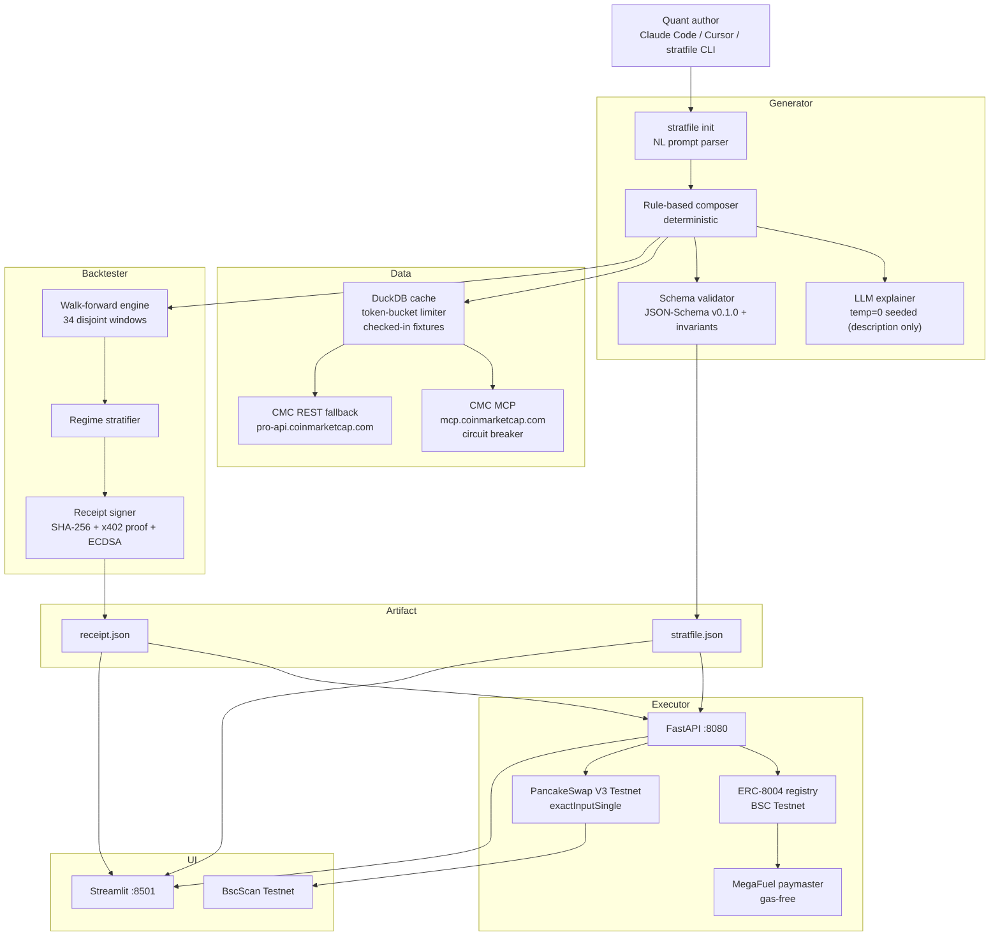

# Architecture

One JSON artifact (`stratfile.json` + paired `receipt.json`), two consumers: a human author
and an on-chain agent. The spec is the contract; everything else is replaceable.

## Determinism contract (§13 of the build spec)

- Same NL prompt + same seed + same schema version → byte-identical `stratfile.json`
  (excluding `metadata.created_at`).
- Same stratfile + same date range + same data snapshot → byte-identical backtest metrics.
- `receipt.json` content hash = `sha256(canonical_json(stratfile body))`, excluding
  `metadata` (volatile) and `description` (prose; may be LLM-polished and LLM output is
  not reproducible across model updates). Two stratfiles that trade identically hash identically.
- Tests are hermetic: no live network, fixtures only.

## Information-set discipline

Every `data_sources[*].shift` must be `<= -1` (schema-enforced). The backtest engine shifts
decision inputs by that lag; execution fills use the unshifted day-t close. A decision at
day t can never see day-t data.

## Failure-mode design

| Dependency | Failure handling |
| --- | --- |
| CMC MCP | Circuit breaker (3 strikes → 120s open) → REST fallback |
| CMC REST | Missing key / 429 / 5xx → DuckDB cache → checked-in fixtures |
| x402 on Base | No funded wallet / unreachable → deterministic stub proof, clearly labeled `mode: stub` |
| bnbagent-sdk | Not importable (unpublished on PyPI) → direct web3.py call → dry-run identity |
| BSC RPC | 3 RPCs tried in order → `--dry-run` keeps the demo alive |
| MegaFuel | Sponsored send fails → normal gas with faucet BNB |
