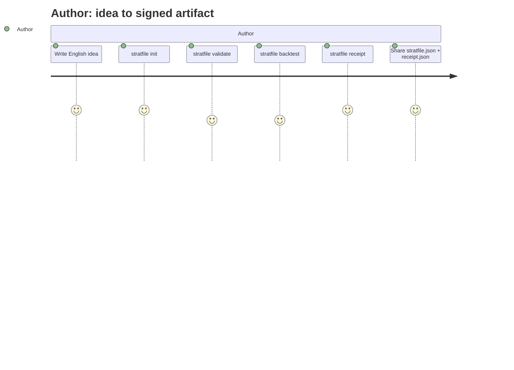
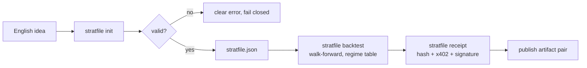
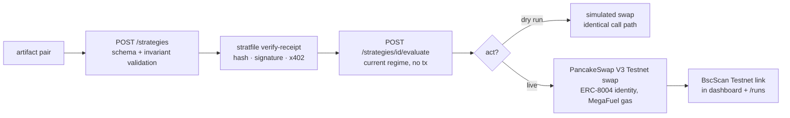

# User journeys

Two sides, one artifact.

## Side A — Author (quant dev in Claude Code / Cursor / terminal)

## Side B — Consumer (on-chain agent / auditor)

The consumer never trusts the author: the receipt is verified by recomputing the content
hash, recovering the ECDSA signer, and checking the x402 payment proof.
